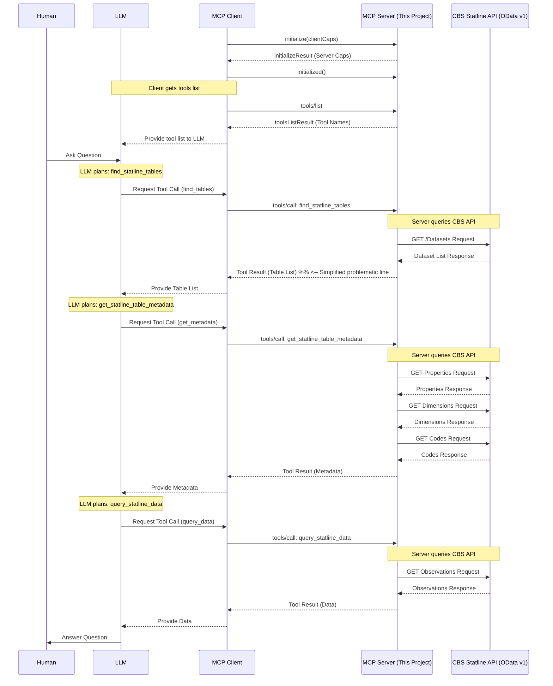

# CBS Statline MCP Server

**Connect Large Language Models to Dutch Statistics via the Model Context Protocol.**

This project provides a **Model Context Protocol (MCP)** server built with **TypeScript** that acts as an interface to the **Dutch Central Bureau for Statistics (CBS) Statline OData v1 API**.

It allows MCP clients (like LLM agents) to discover, understand, and query official Dutch statistical datasets programmatically.

## Features

- **Dataset Discovery:** Search for CBS Statline tables based on keywords.
- **Metadata Retrieval:** Get detailed information about specific tables, including dimensions, descriptions, and sample codes for filtering.
- **Data Querying:** Fetch specific data points from tables with powerful filtering and column selection capabilities.
- **Strongly Typed:** Uses TypeScript and Zod for robust schema validation of inputs and outputs.

## Interaction Flow

The following diagram illustrates how a user, an LLM Agent, the MCP client/server, and the CBS Statline API typically interact when using this server for a data query task:



## Exported example conversation

[average housing price question](https://claude.ai/share/db2a7a0f-e90a-4abb-9b06-8ceb2c62305e)

## Implemented Tools

This server provides the following tools callable via the MCP `tools/call` method:

1.  **`find_statline_tables`**

    - **Description**: Searches the CBS Statline OData Catalog for datasets (tables) matching keywords, ordered by modification date (most recent first). Returns a list including table ID, title, summary, status, frequency, data period, and modification date.
    - **Input**: `{ query: string, maxResults?: number (default 10) }`
    - **Output**: `Array<{ id: string, title: string, summary?: string, status?: string, frequency?: string, period?: string, modified?: string | null }>`

2.  **`get_statline_table_metadata`**

    - **Description**: Retrieves detailed metadata for a specific CBS Statline dataset ID. Returns table properties, available dimensions (with keys and sample codes for filtering), and available measures (data columns).
    - **Input**: `{ tableId: string }`
    - **Output**: `{ tableId: string, properties: Record<string, string | undefined>, dimensions: Array<{ key: string, title: string, description?: string, sampleCodes?: Array<{ id: string, title: string }> }>, measures: Array<{ key: string, title: string, description?: string | null, unit?: string, decimals?: number }> }`

3.  **`query_statline_data`**

    - **Description**: Retrieves data rows (observations) from a CBS Statline table ID using filters based on dimension keys/codes and optionally selects specific columns. Includes a tip to sample data first to identify correct measure codes and value columns.
    - **Input**: `{ tableId: string, filters: Record<string, string>, select?: string[], maxRows?: number (default 100) }`
    - **Output**: `Array<Record<string, string | number | boolean | null>>` (Array of data records)

## Technology Stack

- **Language:** TypeScript
- **Runtime:** Node.js (v18+ recommended for native `Workspace`)
- **Package Manager:** pnpm
- **Protocol:** Model Context Protocol (MCP) via `@modelcontextprotocol/sdk`
- **Schema Validation:** Zod
- **Linting/Formatting:** Biome

## API Interaction

The tools interact primarily with the **CBS Statline OData v1 API** (`https://datasets.cbs.nl/odata/v1/CBS/`).

- Key endpoints used: `/Datasets`, `/{tableId}/Properties`, `/{tableId}/Dimensions`, `/{tableId}/{DimensionId}Codes`, `/{tableId}/Observations`. Note that some metadata calls may use different base URLs like `ODataCatalog` or `ODataApi`.
- OData features used: `$filter` (with `contains`, `tolower`, `eq`, `and`), `$select`, `$top`, `$orderby`.
- **Important:** When using `$filter` with `query_statline_data`, all dimension code values _must_ be enclosed in single quotes (e.g., `Perioden eq '2023JJ00'`). The server handles this escaping.

## Installation

1.  Clone the repository:
    ```bash
    git clone [https://github.com/jwa91/StatlineMCP-TS.git](https://github.com/jwa91/StatlineMCP-TS.git)
    cd StatlineMCP-TS
    ```
2.  Install dependencies using pnpm:
    ```bash
    pnpm install
    ```
3.  Build the TypeScript code:
    ```bash
    pnpm run build
    ```
    This compiles the code into the `build/` directory.

## Running the Server

Start the MCP server using:

```bash
pnpm run start
```

This will execute the compiled JavaScript code located in `build/index.js`. The server listens for MCP communication via standard input/output (stdio). You should see log messages indicating the server is running and tools are registered.

For development, you can use `pnpm run dev` which uses `ts-node` to run the TypeScript code directly with file watching.

## Connecting an MCP Client (Example: Claude Desktop)

To allow an LLM agent (like Claude, via Claude Desktop) to use this server, you need to configure the MCP client to connect to it.

1.  Find the **absolute path** to the compiled `index.js` file within the `build` directory of this project (e.g., `/Users/yourname/projects/StatlineMCP-TS/build/index.js`).

2.  Open the configuration file for your MCP client. For Claude Desktop, this is typically `claude_desktop_config.json` located in its application support directory.

3.  Add or modify the `mcpServers` section to include an entry for this server:

    ```json
    {
      "mcpServers": {
        "cbs-statline": {
          "command": "node",
          "args": ["/absolute/path/to/StatlineMCP-TS/build/index.js"]
        }
      }
      // other servers might be listed here
    }
    ```

    **Important:** Replace `/absolute/path/to/StatlineMCP-TS/build/index.js` with the actual absolute path on your system.

4.  Restart your MCP client (e.g., Claude Desktop) for the changes to take effect.

The client should now be able to discover and call the tools provided by this server.

## Project Structure

- `src/`: Contains the source code.
  - `tools/`: Houses the logic for each MCP tool, typically split into:
    - `handler.ts`: Main entry point for the tool, orchestrates logic, handles MCP interaction.
    - `query.ts`: Contains functions for interacting with the CBS API.
    - `schemas.ts`: Defines Zod schemas for input, output, and intermediate API responses.
  - `shared/`: Contains utility functions and types shared across tools (e.g., logger, API fetch helper).
  - `index.ts`: Main server entry point, initializes the MCP server and registers tools.
- `build/`: Output directory for compiled JavaScript code.
- `biome.json`: Configuration for Biome (linting/formatting).
- `package.json`, `pnpm-lock.yaml`: Project dependencies and scripts.
- `tsconfig.json`: TypeScript configuration.
